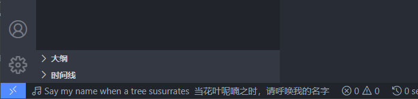

# LyricsIsland Indicator

本插件可以在 Visual Studio Code 的状态栏中显示由 LyricsIsland 协议发送来的歌词。

## 使用方法

1. 在 Marketplace 下载并安装此插件
2. 安装**网易云音乐**，安装[BetterNCM](https://microblock.cc/betterncm)
3. 安装 _DowngradeOK_ 插件将网易云音乐**降级到 2.x 版本**
    > 注：完成此步骤后可能需要重新按照第 2 步的方法安装 BetterNCM
4. 重启网易云音乐，然后在网易云音乐中的 BetterNCM 插件管理器中安装插件 _LyricsIsland_
5. 大功告成！重启网易云音乐并播放你喜欢的歌曲，即可以在状态栏上看到当前播放的音乐的歌词

## 常见问题

1. 提示“无法加载 LyricsIsland：Error: listen EACCES: permission denied 0.0.0.0:50063”

    此问题可能是 LyricsIsland 端口被占用导致的。请关闭其它使用 LyricsIsland 端口的应用（如安装了 LyricsIsland 的 ClassIsland 等）。如果您的电脑上启用了 Hyper-V，请[参考这篇文章的方法](https://zhuanlan.zhihu.com/p/474392069)将 50063 端口从 WinNAT 动态端口的范围中排除。

## 许可

本插件基于 [GNU General Public License v3.0](./LICENSE.txt) 获得许可。
